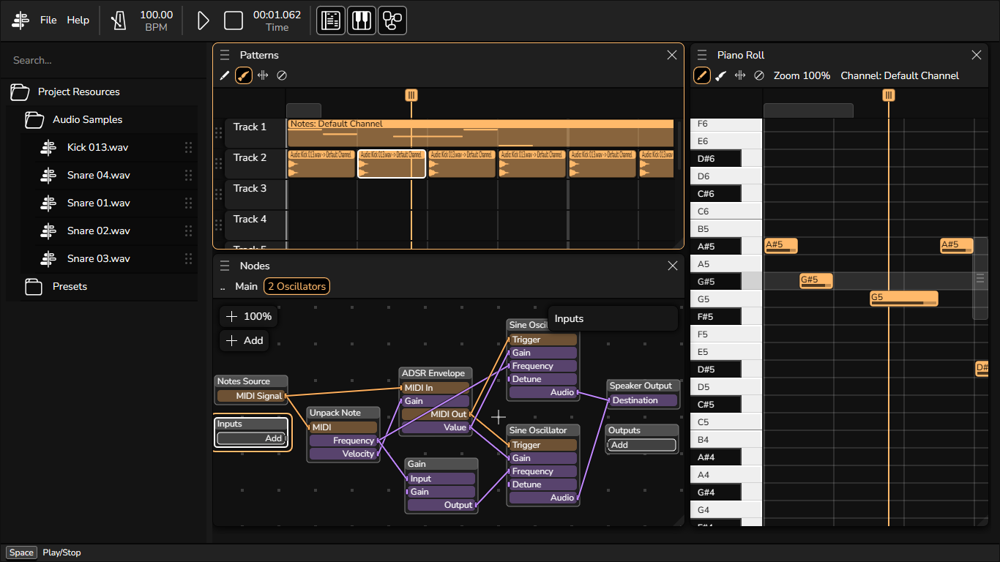

# Mixery
Welcome to Mixery, the free and open source digital audio workspace for the web.

This is the monorepo for Mixery, using pnpm workspace. Other repositories that previously related to the development of Mixery will be archived in the future.

## Try Mixery
You can try Mixery right now at [https://mixeryoss.github.io/mixery/](https://mixeryoss.github.io/mixery/).

## Features
- Nodes editor: Design your own sounds and synths with Nodes editor.
- Runs in your browser.
    + Assuming you are using Chromium browsers like MS Edge or Google Chrome or something like that
- Piano roll and patterns editor: Write your own song like drawing in MSPaint (well, sort of).

## Modules
> All modules are located in `/modules`

- `engine` (`@mixery/engine`): The Mixery engine. This one is designed to not use any front-end frameworks, so you can buld your own user interface that rely on Mixery Engine. An example is an easy version of Mixery, with nodes editor being replaced by generators rack and each playlist track attaches to a channel in nodes network.
- `blobson` (`@mixery/blobson`): The objects serialization module, created to store special objects where JSON can't be used, something like `TypedArray` or `Blob`. Mainly used for saving project data with embedded resources.
- `ui` (`@mixery/ui`): The user interface for Mixery. Currently we are deploying webapp by building this module, but in the future, this will be marked as "components library" and the actual webapp will be located in `@mixery/app`.
- `controller` (`@mixery/controller`): The Mixery Controller core module. Originally created for touch screen devices to connect to Mixery using WebRTC, but you can also use it to send MIDI messages to 3rd party applications (a.k.a virtual MIDI controller).
- `controller-ui` (`@mixery/controller-ui`); The user interface side of Mixery Controller.

## Shortcuts n' keys (in most scenarios)
- Hold Shift to swap between X axis and Y axis while scrolling (so if you are on desktop, hold Shift while scrolling to scroll horizontally).
- Hold Ctrl and scroll to zoom. Some editors allows you to zoom vertically and horizontally, like piano roll for example.

## Copyright and license
(c) The Mixery Contributors 2023. Licensed under GPL 3.0. See [LICENSE](./LICENSE) file that comes with this repository for more information.